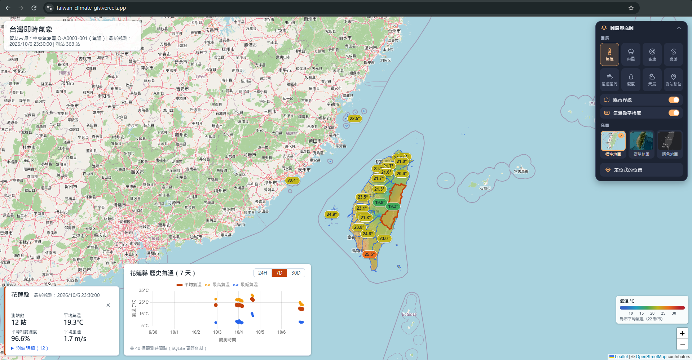
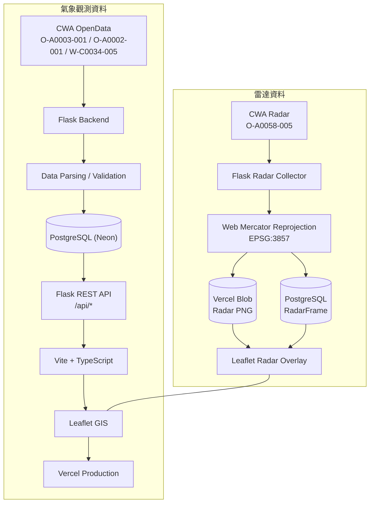
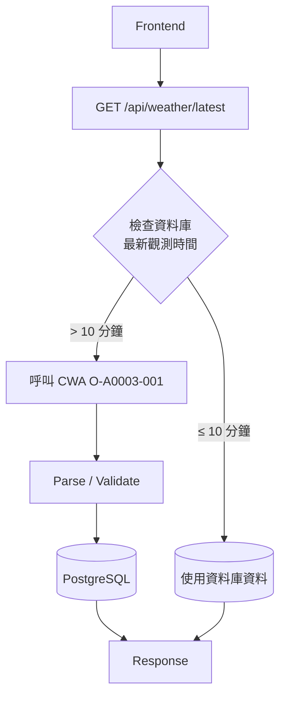

# Taiwan Climate GIS Dashboard

以台灣 GIS 地圖為核心，整合中央氣象署 CWA OpenData 即時與歷史氣象資料的 Web GIS 平台。在同一張地圖上呈現測站觀測、氣象熱圖、動態風場、雷達回波與颱風路徑，並可查詢各縣市的歷史氣象趨勢。

## Demo



- **Production**：<https://taiwan-climate-gis.vercel.app/>
- **GitHub**：<https://github.com/jua91352/taiwan-climate-gis>

## Features

### GIS 地圖

- Leaflet GIS 地圖
- 底圖切換：OpenStreetMap / Esri World Imagery / Dark Map
- 22 縣市邊界，滑鼠移入顯示 Tooltip
- 點擊縣市自動 Zoom，並顯示該縣市目前天氣
- 測站 Marker 與 Station Popup（測站資訊與最新觀測值）
- Responsive UI（窄螢幕自動收合控制面板）

### 即時氣象

- 資料來源：CWA O-A0003-001（自動氣象站即時觀測）
- 氣溫、濕度、風速、風向、UV、降雨、天氣狀況
- 測站位置（縣市、鄉鎮、經緯度）與觀測時間
- Backend 自動更新機制：資料超過 10 分鐘時自動向 CWA 取得新資料

### 氣象圖層

右側控制面板切換，一次顯示一個主圖層。

- **Temperature IDW Heatmap**：以測站實測值做 IDW 內插，搭配縣市溫度標籤與色階圖例
- **Humidity IDW Heatmap**：相對濕度熱圖與色階圖例
- **Rainfall IDW Heatmap**：過去 1 小時雨量熱圖（CWA O-A0002-001）
- **Wind Speed / Direction**：依蒲福風級配色
- **Animated Wind Particles**：以測站風速風向產生的動態粒子風場
- **Weather Condition**：依 CWA 天氣描述分類，顯示各縣市天氣狀況

### 雷達

- 資料來源：CWA O-A0058-005（雷達整合回波）
- Radar Overlay 疊加於地圖，附 dBZ Legend
- 保留最近 2 小時的雷達 frame
- Timeline 依實際觀測時間排列，缺漏時間會顯示為空隙
- Play / Pause、Previous / Next

### 颱風

- 資料來源：CWA W-C0034-005（熱帶氣旋路徑）
- Current Position：目前位置與颱風資訊 Popup
- Historical Track：過去路徑
- Forecast Track：預報路徑
- Forecast Points：各預報時間點與 Popup
- Probability Circles：70% 機率半徑
- Storm Wind Radius：七級風（15 m/s）與十級風（25 m/s）暴風圈
- 目前無颱風時，圖層不顯示任何路徑

### 歷史資料

- 縣市歷史氣象圖表：24H / 7D / 30D
- 使用 Chart.js 繪製
- 歷史觀測持續累積於 PostgreSQL（`WeatherObservation`）

### Backend / Deployment

- Flask REST API
- SQLite（Local Development / Test）
- Neon PostgreSQL（Production）
- Vercel Blob 儲存雷達 PNG
- Vercel Production 部署

## System Architecture



## Data Sources

| Dataset            | 內容                                   | 使用方式                                                            |
| ------------------ | -------------------------------------- | ------------------------------------------------------------------- |
| CWA O-A0003-001    | 現在天氣觀測報告（自動氣象站即時觀測） | 解析、驗證後寫入資料庫，累積歷史資料                                |
| CWA O-A0002-001    | 自動雨量站雨量觀測資料                 | Backend 即時取得並快取 5 分鐘，提供雨量熱圖                         |
| CWA O-A0058-005    | 雷達整合回波透明圖層                   | Backend 收集、重投影後存入 Vercel Blob，metadata 存入 PostgreSQL    |
| CWA W-C0034-005    | 颱風消息與警報－熱帶氣旋路徑           | Backend 即時取得並快取 10 分鐘，提供颱風路徑圖層                    |
| 內政部國土測繪中心 | 直轄市、縣市界線                       | 轉為 GeoJSON 放在 [frontend/src/data/](frontend/src/data/README.md) |

- CWA API Key 只存在 Backend / Server Environment Variables。
- Frontend 不直接呼叫 CWA API，所有 CWA 資料都經由 Flask API 取得。

## Technology Stack

| Layer          | Technology                                                                  |
| -------------- | --------------------------------------------------------------------------- |
| Frontend       | Vite、TypeScript、Leaflet、Chart.js                                         |
| Backend        | Python 3.12、Flask、flask-cors、requests、psycopg、python-dotenv            |
| Database       | PostgreSQL / Neon（Production）、SQLite（Local Development / Test）         |
| Storage        | Vercel Blob（雷達 PNG，使用 `vercel` Python SDK）                           |
| Infrastructure | GitHub、Vercel、Neon PostgreSQL                                             |

## Database

| Table                | 用途                                                                                                                                                        |
| -------------------- | ----------------------------------------------------------------------------------------------------------------------------------------------------------- |
| `Station`            | 測站基本資料：`station_id`、`station_name`、`county_name`、`town_name`、`latitude`、`longitude`                                                             |
| `WeatherObservation` | 測站觀測歷史資料：`station_id`、`observation_time`、`temperature`、`humidity`、`wind_speed`、`wind_direction`、`uv_index`、`precipitation`、`weather` |
| `RadarFrame`         | 雷達 frame metadata：`timestamp`、`file_path`、`source`                                                                                                     |

- `WeatherObservation` 以 `(station_id, observation_time)` 建立唯一索引，同一測站同一時間只會有一筆，重複資料自動略過。
- 資料庫由 `DATABASE_BACKEND` 決定：
  - **Production** → Neon PostgreSQL（`DATABASE_BACKEND=postgres` + `DATABASE_URL`）
  - **Local / Test** → SQLite（預設 `data/weather.db`）
- 本機累積的 SQLite 歷史資料可用 `backend/import_weather_to_postgres.py` 匯入 PostgreSQL（預設 dry run，加 `--execute` 才寫入）。

## Weather Data

O-A0003-001 每筆觀測包含：

| 欄位               | 說明                                   |
| ------------------ | -------------------------------------- |
| `temperature`      | 氣溫（°C）                             |
| `humidity`         | 相對濕度（%）                          |
| `wind_speed`       | 風速（m/s）                            |
| `wind_direction`   | 風向（度）                             |
| `uv_index`         | 紫外線指數                             |
| `precipitation`    | 降雨                                   |
| `weather`          | 天氣狀況（CWA 天氣描述文字）           |
| `observation_time` | 觀測時間（CWA 的 +08:00 ISO 8601 時間）|
| station location   | 縣市、鄉鎮、經緯度                     |

CWA 回傳的缺漏或無效值會轉成 `NULL` 儲存，前端顯示為「資料不足」，不會被當成 0 計算。

## Weather Refresh

前端讀取資料時，Backend 會依資料新舊決定是否向 CWA 取得新資料：



- 若 CWA 呼叫失敗但資料庫已有舊資料，會保留舊資料回應，並以 `data_stale` / `refresh_error` 標示資料可能過期。
- 回應中的 `data_updated` 表示此次請求是否取得了新資料。

## Radar

- 資料來源：CWA O-A0058-005 雷達整合回波透明圖層。
- CWA 約每 10 分鐘更新一張；Backend 確認 PNG 與 metadata 屬於同一觀測時間後才儲存。
- 原始影像重投影為 Web Mercator（EPSG:3857），讓 Leaflet 能正確疊在地圖上。
- 保留最近 2 小時的 frame（最多 13 frames），較舊的 frame 會連同 PNG 一起刪除。
- PNG 存在 Vercel Blob，`RadarFrame` metadata 存在 PostgreSQL。
- 圖片經 `/api/radar/frames/<filename>` 302 轉址到 Vercel Blob CDN，Flask 不轉送圖片內容。
- 前端提供 Timeline、Play / Pause、Previous / Next 與 dBZ Legend。

收集時機：

| 環境       | 方式                                                                                                     |
| ---------- | -------------------------------------------------------------------------------------------------------- |
| Local      | Flask 啟動時開啟背景收集器，每 10 分鐘收集一次                                                           |
| Production | `RADAR_COLLECTOR=0` 關閉背景收集器；呼叫 `/api/radar/history` 時，若最新 frame 已過期就先補抓再回應 |

## API

所有 endpoint 皆位於 `/api` 底下（[backend/app.py](backend/app.py)、[backend/routes.py](backend/routes.py)）。

| Method | Endpoint                                         | Description                                                          |
| ------ | ------------------------------------------------ | -------------------------------------------------------------------- |
| GET    | `/api/health`                                    | 健康檢查                                                             |
| GET    | `/api/weather/latest`                            | 所有測站最新觀測（含 `data_updated`、`data_stale`、`refresh_error`） |
| GET    | `/api/weather/county/<county_name>`              | 縣市最新觀測與平均氣溫 / 濕度 / 風速（接受「台」或「臺」）           |
| GET    | `/api/weather/history?county=<縣市>&days=<1-30>` | 縣市歷史觀測，`days` 預設 7                                          |
| GET    | `/api/stations`                                  | 測站清單                                                             |
| GET    | `/api/weather/station/<station_id>`              | 單一測站資訊與最新觀測                                               |
| GET    | `/api/rainfall/latest`                           | 最新雨量（O-A0002-001）                                              |
| GET    | `/api/typhoon/latest`                            | 目前熱帶氣旋路徑（W-C0034-005），無颱風時回傳空清單                  |
| GET    | `/api/radar/history`                             | 雷達 frame 清單、地圖範圍（bounds）與投影                            |
| GET    | `/api/radar/frames/<filename>`                   | 雷達 PNG（Production 302 轉址至 Vercel Blob）                        |

## Project Structure

```text
.
├── README.md
├── DESIGN.md                          # 設計規格
├── pyproject.toml                     # Python 專案設定（Vercel Flask entrypoint）
├── requirements.txt                   # Python 套件
├── vercel.json                        # Vercel Services：web（Vite）+ api（Flask）
├── .env.example                       # 環境變數範例（不含真實金鑰）
├── backend/
│   ├── app.py                         # Flask app、/api/health、雷達背景收集器
│   ├── routes.py                      # REST API
│   ├── db.py                          # SQLite / PostgreSQL 資料存取
│   ├── cwa_api.py                     # O-A0003-001 取得、解析、驗證、寫入
│   ├── weather_refresh.py             # 讀取時自動更新（超過 10 分鐘）
│   ├── cwa_rainfall.py                # O-A0002-001 雨量
│   ├── cwa_typhoon.py                 # W-C0034-005 颱風路徑
│   ├── radar.py                       # O-A0058-005 雷達收集與保留
│   ├── radar_png.py                   # 雷達 PNG 重投影（Web Mercator）
│   ├── radar_storage.py               # 雷達 PNG 儲存：本機檔案 / Vercel Blob
│   └── import_weather_to_postgres.py  # SQLite → PostgreSQL 歷史資料匯入
├── frontend/
│   ├── index.html
│   ├── package.json
│   ├── vite.config.ts                 # dev server 將 /api 代理到 Flask
│   └── src/
│       ├── main.ts                    # 進入點，組合地圖與各圖層
│       ├── api.ts                     # Flask API 型別化 client
│       ├── map.ts / mapControls.ts    # 底圖與右側控制面板
│       ├── gis.ts                     # 縣市邊界
│       ├── stations.ts                # 測站 Marker 與 Popup
│       ├── countyWeather.ts           # 縣市目前天氣面板
│       ├── historyChart.ts            # 歷史資料圖表（Chart.js）
│       ├── heatmapSurface.ts          # IDW 熱圖
│       ├── temperatureLayer.ts / humidityHeatmap.ts / rainfallHeatmap.ts
│       ├── windLayer.ts / windParticles.ts
│       ├── weatherLayer.ts
│       ├── typhoonLayer.ts
│       ├── radarLayer.ts / radarTimeline.ts / radarLegend.ts
│       ├── legend.ts / dataSource.ts / geolocation.ts
│       ├── style.css
│       └── data/taiwan-counties.geojson
├── tests/                             # Backend unittest 與 CWA fixtures
├── docs/
│   └── screenshot-home.png            # README Demo 截圖
└── data/                              # 本機 SQLite 與雷達 PNG（不進 Git）
```

## Local Development

需求：Python 3.12+、Node.js。

**1. 環境變數**

```bash
cp .env.example .env
# 編輯 .env，填入自己的 CWA_API_KEY
```

本機未設定其他變數時，使用 SQLite（`data/weather.db`）與本機雷達資料夾（`data/radar/`）。

**2. Backend（Flask，port 5000）**

```bash
python -m venv .venv
# Windows: .venv\Scripts\activate
# macOS / Linux: source .venv/bin/activate
pip install -r requirements.txt
python -m backend.app
```

**3. Frontend（Vite，port 5173）**

```bash
cd frontend
npm install
npm run dev
```

開啟 <http://localhost:5173/>，Vite 會把 `/api` 代理到 `http://127.0.0.1:5000`。

其他指令：

```bash
npm run typecheck   # TypeScript 型別檢查
npm run build       # 型別檢查 + 正式版建置
```

## Deployment

```text
GitHub → Vercel → Production
```

使用 Vercel Services，在同一個專案部署前後端：

| Service | Root        | 說明                                    |
| ------- | ----------- | --------------------------------------- |
| `web`   | `frontend/` | Vite frontend                           |
| `api`   | `.`         | Flask backend（`backend.app:app`）      |

- `/api/*` 轉到 Flask，其餘路徑轉到前端。
- **Production**：<https://taiwan-climate-gis.vercel.app/>
- **Database**：Neon PostgreSQL
- **Radar**：Vercel Blob

Production 環境變數（於 Vercel Project Settings 設定，此處不列出實際值）：

| Variable                | 說明                          |
| ----------------------- | ----------------------------- |
| `CWA_API_KEY`           | CWA OpenData API Key          |
| `DATABASE_BACKEND`      | `postgres`                    |
| `DATABASE_URL`          | Neon PostgreSQL 連線字串      |
| `BLOB_READ_WRITE_TOKEN` | Vercel Blob token（雷達 PNG） |
| `RADAR_COLLECTOR`       | `0`，關閉背景收集器           |

## Security

- CWA API Key 不進 Git，`.env.example` 只放範例值。
- `.env` 已加入 `.gitignore`，不進 Git。
- Production 使用 Vercel Environment Variables。
- Frontend 不直接呼叫 CWA API，也不會取得 CWA API Key。
- Vercel Blob token 只在 Backend 使用，不會暴露給 Frontend，也不會被記錄或回傳。

## Testing

Backend 使用 Python `unittest`。CWA 與 Vercel Blob 皆以 fake 取代，測試不會連網，也不會碰到 Production 資料。

**目前結果：151 tests OK，4 個 PostgreSQL-only tests skipped（以 SQLite 執行）。**

| 模組                   | 內容                                                               |
| ---------------------- | ------------------------------------------------------------------ |
| `test_weather_history` | 歷史資料儲存、重複資料、缺漏值、查詢區間、縣市平均                 |
| `test_weather_refresh` | 讀取時自動更新、CWA 失敗時的 stale 處理、並行請求                  |
| `test_weather_field`   | 天氣描述欄位解析與 SQLite migration                                |
| `test_typhoon`         | W-C0034-005 解析、快取與 `/api/typhoon/latest`                     |
| `test_radar`           | 雷達收集、PNG 重投影與 `/api/radar/*`                              |
| `test_radar_lifecycle` | 保留期限、重複 frame、重新啟動、檔案與資料庫一致性、並行、CWA 失敗 |
| `test_radar_storage`   | 本機與 Vercel Blob 儲存                                            |
| `test_radar_frame_db`  | `RadarFrame` metadata 存取                                         |
| `test_import_weather`  | SQLite → PostgreSQL 匯入（僅 PostgreSQL）                          |

以 SQLite 執行：

```bash
python -m unittest tests.test_import_weather tests.test_radar tests.test_radar_frame_db tests.test_radar_lifecycle tests.test_radar_storage tests.test_typhoon tests.test_weather_field tests.test_weather_history tests.test_weather_refresh
```

以本機暫時的 PostgreSQL 執行全部測試（需先 `pip install pgserver`）：

```bash
python tests/run_postgres.py
```

## Project Status

**Status: Production**

系統已部署至 Vercel Production：<https://taiwan-climate-gis.vercel.app/>

| Component | Technology                      |
| --------- | ------------------------------- |
| Frontend  | Vite + TypeScript + Leaflet     |
| Backend   | Flask                           |
| Database  | Neon PostgreSQL                 |
| Storage   | Vercel Blob                     |
| Data      | CWA OpenData                    |
