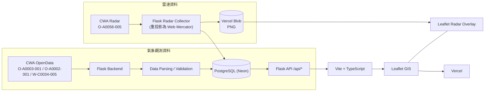

# Taiwan Climate GIS Dashboard

以台灣 GIS 地圖為核心，整合中央氣象署 CWA OpenData 的即時與歷史氣象資料之 Web GIS 平台。

## Demo

- Production：<https://taiwan-climate-gis.vercel.app/>
- GitHub：<https://github.com/jua91352/taiwan-climate-gis>

## Features

**GIS 地圖**

- 台灣 GIS 地圖（Leaflet）
- 標準（OpenStreetMap）/ 衛星（Esri World Imagery）/ 暗色底圖切換
- 22 縣市邊界與互動：Tooltip、點擊縣市 Zoom、顯示縣市目前天氣面板
- 測站點位與 Station Popup（測站資訊與最新觀測值）
- Responsive Web UI（窄螢幕自動收合控制面板）

**氣象圖層**（右側控制面板，一次顯示一個主圖層）

- 溫度圖層：以測站實測值做 IDW 內插的熱圖、縣市溫度標籤、色階圖例
- 濕度圖層：相對濕度 IDW 熱圖與色階圖例
- 雨量圖層：過去 1 小時雨量 IDW 熱圖與色階圖例（CWA O-A0002-001）
- 風速 / 風向圖層：依蒲福風級配色
- 動態風場：以測站風速風向產生的粒子動畫
- 天氣狀況：依 CWA 天氣描述分類，顯示各縣市天氣
- 颱風路徑圖層：熱帶氣旋路徑、預報路徑、暴風圈（CWA W-C0034-005）
- 雷達回波圖（CWA O-A0058-005）與 dBZ 色階圖例

**雷達時間軸**

- 雷達時間軸：依實際觀測時間排列 frame，缺漏的時間會顯示為空隙
- 雷達播放：播放 / 暫停、上一張 / 下一張
- 雷達歷史資料：保留最近 2 小時的雷達 frame

**歷史資料**

- 歷史氣象資料持續累積於資料庫
- 縣市歷史資料圖表：24 小時 / 7 天 / 30 天查詢（Chart.js）

**後端與部署**

- 自動更新 CWA 資料：API 被讀取時，若資料庫最新觀測已超過 10 分鐘，Backend 會先向 CWA 取得新資料再回應
- PostgreSQL / Neon 儲存測站、觀測與雷達 metadata
- Vercel Blob 儲存雷達 PNG 影像
- Vercel Production 部署（Vite 前端與 Flask API 以 Vercel Services 一同部署）

## System Architecture



純文字版：

```text
CWA OpenData
→ Flask Backend
→ Data Parsing / Validation
→ PostgreSQL (Neon)
→ Flask API
→ Vite + TypeScript
→ Leaflet GIS
→ Vercel

CWA Radar (O-A0058-005)
→ Flask Radar Collector
→ Vercel Blob（PNG）+ PostgreSQL（RadarFrame metadata）
→ Leaflet Radar Overlay
```

## Data Sources

| Dataset | 內容 | 使用方式 |
| ------- | ---- | -------- |
| CWA O-A0003-001 | 現在天氣觀測報告（自動氣象站即時觀測） | 解析、驗證後寫入資料庫，累積歷史資料 |
| CWA O-A0002-001 | 自動雨量站雨量觀測資料 | Backend 即時取得並快取 5 分鐘 |
| CWA O-A0058-005 | 雷達整合回波透明圖層 | Backend 收集、重投影後存入 Vercel Blob |
| CWA W-C0034-005 | 颱風消息與警報－熱帶氣旋路徑 | Backend 即時取得並快取 10 分鐘 |
| 內政部國土測繪中心 | 直轄市、縣市界線 | 轉為 GeoJSON 放在 [frontend/src/data/](frontend/src/data/README.md) |

- CWA API Key 只存在 Backend / Server Environment Variables。
- Frontend 不直接呼叫 CWA API，所有 CWA 資料都經由 Flask API 取得。

## Technology Stack

| Layer | Technology |
| ----- | ---------- |
| Backend | Python 3.12、Flask、flask-cors、requests、psycopg、python-dotenv |
| Frontend | Vite、TypeScript、Leaflet、Chart.js |
| Database | PostgreSQL（Neon，Production）；SQLite（Local Development / Test） |
| Storage | Vercel Blob（雷達 PNG，使用 `vercel` Python SDK） |
| Infrastructure | GitHub、Vercel、Neon PostgreSQL、Vercel Blob |

## Database

主要資料表：

| Table | 說明 |
| ----- | ---- |
| `Station` | 測站資料：`station_id`、`station_name`、`county_name`、`town_name`、`latitude`、`longitude` |
| `WeatherObservation` | 測站觀測資料：`station_id`、`observation_time`、`temperature`、`humidity`、`wind_speed`、`wind_direction`、`uv_index`、`precipitation`、`weather` |
| `RadarFrame` | 雷達 frame metadata：`timestamp`、`file_path`、`source` |

- `WeatherObservation` 以 `(station_id, observation_time)` 建立唯一索引，同一測站同一時間只會有一筆，重複資料自動略過。
- 資料庫後端由 `DATABASE_BACKEND` 決定：
  - Production 使用 Neon PostgreSQL（`DATABASE_BACKEND=postgres` + `DATABASE_URL`）。
  - Local development 預設使用 SQLite（`data/weather.db`）。
- 本機累積的 SQLite 歷史資料可用 `backend/import_weather_to_postgres.py` 匯入 PostgreSQL（預設 dry run，加 `--execute` 才寫入）。

## Weather Data

O-A0003-001 每筆觀測包含：

- 氣溫（°C）
- 相對濕度（%）
- 風速（m/s）
- 風向（度）
- 降雨
- 紫外線指數
- 天氣狀況（CWA 天氣描述文字）
- 觀測時間（CWA 的 +08:00 ISO 8601 時間）
- 測站位置（縣市、鄉鎮、經緯度）

缺漏或無效的數值會存成 `NULL`，前端顯示為「資料不足」，不會被當成 0 計算。

## Radar

- 資料來源：CWA O-A0058-005 雷達整合回波透明圖層。
- CWA 約每 10 分鐘更新一張；Backend 會確認 PNG 與 metadata 屬於同一個觀測時間後才儲存。
- 原始影像會重投影為 Web Mercator（EPSG:3857），讓 Leaflet 能正確疊在地圖上。
- 保留最近 2 小時的歷史 frame（最多 13 張），較舊的 frame 會連同 PNG 一起刪除。
- PNG 存在 Vercel Blob，`RadarFrame` metadata 存在 PostgreSQL。
- 收集時機：
  - 本機：Flask 啟動時會開啟背景收集器，每 10 分鐘收集一次。
  - Production：Vercel 上關閉背景收集器（`RADAR_COLLECTOR=0`），改為呼叫 `/api/radar/history` 時，若最新 frame 已過期就先補抓。
- 前端提供時間軸、播放 / 暫停、上一張 / 下一張與 dBZ 圖例。
- 圖片經 `/api/radar/frames/<filename>` 302 轉址到 Vercel Blob CDN，Flask 不轉送圖片內容。

## API

所有 endpoint 都在 `/api` 底下（[backend/app.py](backend/app.py)、[backend/routes.py](backend/routes.py)）。

| Method | Endpoint | 說明 |
| ------ | -------- | ---- |
| GET | `/api/health` | 健康檢查 |
| GET | `/api/weather/latest` | 所有測站最新觀測（含 `data_updated`、`data_stale`、`refresh_error`） |
| GET | `/api/weather/county/<county_name>` | 縣市最新觀測與平均氣溫 / 濕度 / 風速（接受「台」或「臺」） |
| GET | `/api/weather/history?county=<縣市>&days=<1-30>` | 縣市歷史觀測，`days` 預設 7 |
| GET | `/api/stations` | 測站清單 |
| GET | `/api/weather/station/<station_id>` | 單一測站資訊與最新觀測 |
| GET | `/api/rainfall/latest` | 最新雨量（O-A0002-001） |
| GET | `/api/typhoon/latest` | 目前熱帶氣旋路徑（W-C0034-005），無颱風時回傳空清單 |
| GET | `/api/radar/history` | 雷達 frame 清單、地圖範圍（bounds）與投影 |
| GET | `/api/radar/frames/<filename>` | 雷達 PNG（Production 轉址至 Vercel Blob） |

## Project Structure

```text
.
├── README.md
├── DESIGN.md                      # 設計規格
├── pyproject.toml                 # Python 專案設定（Vercel Flask entrypoint）
├── requirements.txt               # Python 套件（與 pyproject.toml 同步）
├── vercel.json                    # Vercel Services：web（Vite）+ api（Flask）
├── .env.example
├── backend/
│   ├── app.py                     # Flask app、/api/health、雷達背景收集器
│   ├── routes.py                  # REST API
│   ├── db.py                      # SQLite / PostgreSQL 資料存取
│   ├── cwa_api.py                 # O-A0003-001 取得、解析、驗證、寫入
│   ├── weather_refresh.py         # 讀取時自動更新（超過 10 分鐘）
│   ├── cwa_rainfall.py            # O-A0002-001 雨量
│   ├── cwa_typhoon.py             # W-C0034-005 颱風路徑
│   ├── radar.py                   # O-A0058-005 雷達收集與保留
│   ├── radar_png.py               # 雷達 PNG 重投影（Web Mercator）
│   ├── radar_storage.py           # 雷達 PNG 儲存：本機檔案 / Vercel Blob
│   └── import_weather_to_postgres.py  # SQLite → PostgreSQL 歷史資料匯入
├── frontend/
│   ├── index.html
│   ├── package.json
│   ├── vite.config.ts             # dev server 將 /api 代理到 Flask
│   └── src/
│       ├── main.ts                # 進入點，組合地圖與各圖層
│       ├── api.ts                 # Flask API 型別化 client
│       ├── map.ts / mapControls.ts    # 底圖與右側控制面板
│       ├── gis.ts                 # 縣市邊界
│       ├── stations.ts            # 測站與 Popup
│       ├── countyWeather.ts       # 縣市目前天氣面板
│       ├── historyChart.ts        # 歷史資料圖表
│       ├── heatmapSurface.ts      # IDW 熱圖
│       ├── temperatureLayer.ts / humidityHeatmap.ts / rainfallHeatmap.ts
│       ├── windLayer.ts / windParticles.ts
│       ├── weatherLayer.ts
│       ├── typhoonLayer.ts
│       ├── radarLayer.ts / radarTimeline.ts / radarLegend.ts
│       ├── legend.ts / dataSource.ts / geolocation.ts
│       ├── style.css
│       └── data/taiwan-counties.geojson
├── data/                          # 本機 SQLite 與雷達 PNG（不進 Git）
└── tests/                         # Backend unittest
```

## Local Development

需求：Python 3.12+、Node.js。

**1. 環境變數**

```bash
cp .env.example .env
# 編輯 .env，填入自己的 CWA_API_KEY
```

本機不設定其他變數時，使用 SQLite（`data/weather.db`）與本機雷達資料夾（`data/radar/`）。

**2. Backend（Flask，port 5000）**

```bash
python -m venv .venv
# Windows: .venv\Scripts\activate
# macOS / Linux: source .venv/bin/activate
pip install -r requirements.txt
python -m backend.app
```

**3. Frontend（Vite，port 5173）**

```bash
cd frontend
npm install
npm run dev
```

開啟 <http://localhost:5173/>，Vite 會把 `/api` 代理到 `http://127.0.0.1:5000`。

其他指令：

```bash
npm run typecheck   # TypeScript 型別檢查
npm run build       # 型別檢查 + 正式版建置
```

## Deployment

```text
GitHub
→ Vercel
→ Production
```

- [vercel.json](vercel.json) 以 Vercel Services 部署兩個服務：`web`（`frontend/`，Vite）與 `api`（Flask，`backend.app:app`）。
- `/api/*` 轉到 Flask，其餘路徑轉到前端。
- Production 環境變數（在 Vercel Project Settings 設定）：

| Variable | 說明 |
| -------- | ---- |
| `CWA_API_KEY` | CWA OpenData API Key |
| `DATABASE_BACKEND` | `postgres` |
| `DATABASE_URL` | Neon PostgreSQL 連線字串 |
| `BLOB_READ_WRITE_TOKEN` | Vercel Blob token（雷達 PNG） |
| `RADAR_COLLECTOR` | `0`，關閉背景收集器 |

Production URL：<https://taiwan-climate-gis.vercel.app/>

## Security

- CWA API Key 不進 Git，`.env.example` 只放範例值。
- 本機使用 `.env`，Production 使用 Vercel Environment Variables。
- `.env` 已加入 `.gitignore`。
- Frontend 不直接呼叫 CWA API，也不會拿到 CWA API Key。
- Backend 的錯誤訊息不包含 API Key；Vercel Blob token 不會被記錄或回傳。

## Testing

Backend 使用 Python `unittest`，共 9 個測試模組、151 個測試。CWA 與 Vercel Blob 都以 fake 取代，測試不會連網，也不會碰到 Production 資料。

| 模組 | 內容 |
| ---- | ---- |
| `test_weather_history` | 歷史資料儲存、重複資料、缺漏值、查詢區間、縣市平均 |
| `test_weather_refresh` | 讀取時自動更新、CWA 失敗時的 stale 處理、並行請求 |
| `test_weather_field` | 天氣描述欄位解析與 SQLite migration |
| `test_typhoon` | W-C0034-005 解析、快取與 `/api/typhoon/latest` |
| `test_radar` | 雷達收集、PNG 重投影與 `/api/radar/*` |
| `test_radar_lifecycle` | 保留期限、重複 frame、重新啟動、檔案與資料庫一致性、並行、CWA 失敗 |
| `test_radar_storage` | 本機與 Vercel Blob 儲存 |
| `test_radar_frame_db` | `RadarFrame` metadata 存取 |
| `test_import_weather` | SQLite → PostgreSQL 匯入（僅 PostgreSQL） |

以 SQLite 執行（目前結果：151 tests OK，4 個 PostgreSQL 專用測試略過）：

```bash
python -m unittest tests.test_import_weather tests.test_radar tests.test_radar_frame_db tests.test_radar_lifecycle tests.test_radar_storage tests.test_typhoon tests.test_weather_field tests.test_weather_history tests.test_weather_refresh
```

以本機暫時的 PostgreSQL 執行全部測試（需先 `pip install pgserver`）：

```bash
python tests/run_postgres.py
```

## Project Status

**Status: Production**

系統已部署至 Vercel Production（<https://taiwan-climate-gis.vercel.app/>），使用 Neon PostgreSQL 儲存氣象資料、Vercel Blob 儲存雷達影像。
